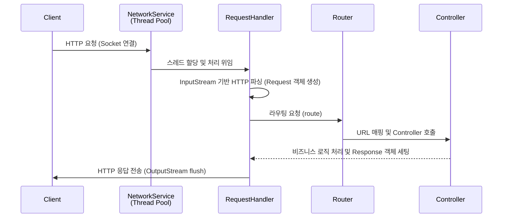

# mini java was project

Java의 Socket API를 사용해 HTTP 요청/응답을 직접 처리하는
학습용 HTTP 웹 서버 프로젝트입니다.

## 핵심 구현 기능
- HTTP/1.1 프로토콜 파싱: Request Line, Header, Body파싱 및 객체화
- 요청/응답 객체 설계
- 정적 파일 서빙 기능
- 동적 요청 처리: Controller인터페이스를 통한 로직 분리
- Thread pool

### 추가 구현 예정
- 쿠키/세션 구현

## 아키텍처 및 동작 흐름



## 회고
https://outrageous-fowl-618.notion.site/WAS-3124a6bc857e808686b8c766c5cb4016?source=copy_link


## 로컬 실행 방법

### 1. 저장소 클론
```bash
git clone https://github.com/chc216/was-project.git
cd was-project
```
### 2. 소스코드 컴파일 및 빌드
```bash
javac -d out $(find src -name "*.java")

## jar패키지에 포함할 정적 파일을 복사합니다.
cp -r src/staticfile out/

jar cvfm WebServer.jar manifest.txt -C out .
```

### 5. 실행
```bash
# 기본 포트 8080 사용
java -jar WebServer.jar 

# 포트 지정 및 쓰레드풀 사이즈 지정하여 실행
java -jar WebServer.jar 8000 100
```


